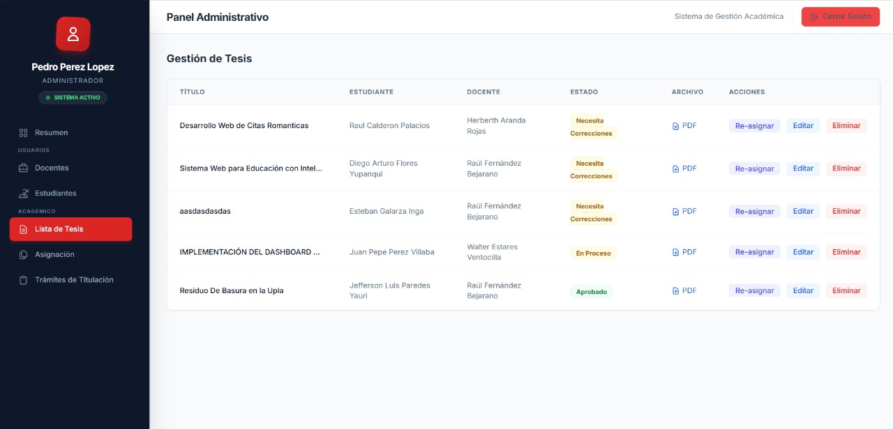
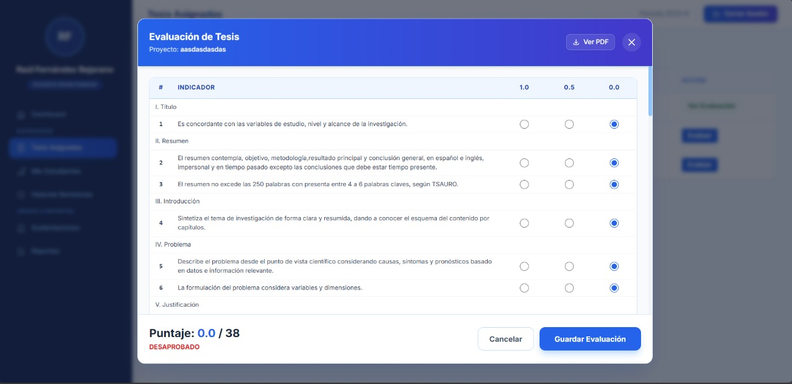

# Sistema de Gestión de Tesis – UPLA
Hackathon UPLA 2025-2  
Facultad: Ingeniería - Sistemas y Computación  
Fecha: 21 de noviembre 2025

## 1. Información del Equipo
**Nombre del Equipo:** Los Espectros

### Integrantes
| Nombre | Rol Principal |
|--------|---------------|
| Flores Yupanqui Diego Arturo | Desarrollador BackEnd |
| Matias Urcuhuaranga Frank Diego | Requerimiento y especificaciones |
| Paredes Yauri Jefferson Luis | Desarrollador FrontEnd |

## 2. El Problema
### ¿Qué necesidad se detectó?
Actualmente, el proceso de seguimiento de tesis en la facultad se realiza de manera manual y desarticulada. Los estudiantes envían avances por correo, los docentes pierden el rastro de las versiones y la administración no tiene métricas claras del avance académico.

### ¿A quién afecta?
- **Estudiantes:** Sufren ansiedad por la falta de feedback claro y tiempos de espera inciertos.
- **Docentes:** Se sobrecargan administrativamente revisando correos dispersos.
- **Facultad:** Pierde trazabilidad y data valiosa para la toma de decisiones.

### ¿Por qué es importante resolverlo?
Es crucial optimizar este proceso para reducir la tasa de abandono de tesis y mejorar los indicadores de investigación de la facultad. Al digitalizar el flujo, se libera tiempo valioso para que docentes y alumnos se concentren en la calidad académica en lugar de trámites burocráticos, lo cual impacta directamente en la acreditación y prestigio institucional.

## 3. Nuestra Solución
### ¿Qué hace el producto?
Una plataforma web centralizada que digitaliza el ciclo de vida completo de la tesis.

### ¿Qué lo hace diferente? (Valor Diferencial)
- **Feedback Estructurado:** Implementamos una rúbrica digital de 38 puntos, no solo un campo de texto libre.
- **Transparencia Total:** El alumno sabe exactamente en qué etapa está su trámite y quién lo tiene.
- **Cero Papel:** Eliminamos la necesidad de impresiones físicas para revisiones preliminares.

## 4. Tecnologías Utilizadas
El proyecto se construyó priorizando la escalabilidad y el rendimiento:
- **Backend:** Java (JDK 17+) con Servlets/JSP (Modelo MVC).
- **Base de Datos:** MySQL 8.0 (Relacional).
- **Frontend:** HTML5, CSS3, JavaScript (Diseño Responsivo).
- **Herramientas:** Apache NetBeans, Maven, Git.

## 5. Capturas de Pantalla
### A. Panel del Estudiante
Visualización clara del estado de aprobación y acceso a rúbricas.


### B. Panel del Docente
Gestión de carga laboral con indicadores visuales (Semáforo de tareas).


### C. Panel Administrativo
Control total de usuarios y asignación de revisores.


### D. Vista General del Sistema


## 6. Cómo Ejecutar el Prototipo
### Requisitos Previos
- Java JDK 8 o superior.
- Servidor Apache Tomcat (integrado en NetBeans).
- MySQL Server activo.

### Pasos de Instalación
1. **Clonar el Repositorio:** Descargue el código fuente (src).
2. **Base de Datos:** Importe el archivo `database/script.sql` en MySQL Workbench.
3. **Configurar:** Verifique que las credenciales en `src/main/java/datos/Conexion.java` coincidan con su BD local.
4. **Ejecutar:** Abra el proyecto en NetBeans y presione Run (F6).
5. **Acceso:** El sistema abrirá en `http://localhost:8080/GestionTesis`.

### Credenciales de Prueba
- **Admin:** admin@ms.upla.edu.pe | admin123
- **Docente:** d.rfernandez@ms.upla.edu.pe | raul123
- **Alumno:** a.dflores@ms.upla.edu.pe | diego123

## 7. Estructura del Proyecto
```
/Proyecto-Tesis
│── /src           # Código Fuente Java y Webapp
│── /docs          # Manuales (Usuario, Técnico, Instalación)
│── /database      # Script SQL de la BD
│── /recursos      # Imágenes y Presentación PPT
└── README.md      # Este archivo
```
